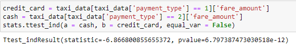

# Performing-a-A/B-testing-using-python
The goal for this A/B test is to sample data and analyze whether there is a relationship between payment type and fare amount. For example: discover if customers who use credit cards pay higher fare amounts than customers who use cash.

## Overview 

The primary objective of this project is to conduct A/B testing using the New York City Taxi & Limousine Commission (TLC) dataset with the aim of extracting valuable insights that will inform strategies for enhancing income levels. By leveraging this dataset and statistical experimentation, we seek to identify and evaluate potential improvements and enhancements within the context of taxi and limousine services in New York City. The ultimate goal is to harness these insights to drive data-driven decisions and initiatives that will positively impact the income streams of individuals and organizations operating within this industry.

## Business Understanding 

In our quest to understand the business better, this A/B testing project is all about answering a simple question: Do customers who use credit cards tend to spend more on fares than those who prefer cash? By exploring this, we hope to get a clearer picture of how people like to pay for their taxi and limousine rides and whether one payment method can potentially boost the income of service providers more than the other. Our aim is to find insights that will help us prioritize the payment option that could make drivers and companies earn more money in the end.

## Data Understanding

This project used a dataset called "2017_Yellow_Taxi_Trip_Data.csv."
The data in "2017_Yellow_Taxi_Trip_Data.csv" was gathered by the New York City Taxi & Limousine Commission and published by the city of New York as part of their NYC Open Data program.
Refer to [NYC taxi dataset](https://data.cityofnewyork.us/Transportation/2017-Yellow-Taxi-Trip-Data/biws-g3hs) for more informations.

## Model and Evaluation

After preparing the dataset, we initiated two hypothesis.

$H_0$: There is no difference in the average fare amount between customers who use credit cards and customers who use cash. (null hypothesis)

$H_A$: There is a difference in the average fare amount between customers who use credit cards and customers who use cash. (alternative hypothesis)

Following the formulation of the two hypotheses, we proceeded to perform a two-sample t-test, the outcomes of which are depicted in the image below.

    

As illustrated in the image, the calculated p-value of 6.797387473030518e-12 is notably lower than the predetermined significance level of 0.05 (5%). Consequently, we reject the null hypothesis, leading us to adopt the alternative hypothesis.

## Conclusion

A/B testing proves to be an invaluable tool in scenarios where the goal is to determine the superior approach or option. By systematically comparing different variations and rigorously analyzing the results, it offers a data-driven means to identify the most effective path forward. In this way, A/B testing serves as a compass guiding decision-makers toward choices that are better, ultimately leading to more informed and successful outcomes.
